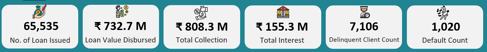

#  Bank Loan Data Analytics Dashboard (Excel)

##  Project Overview
This project showcases an **end-to-end Bank Loan Data Analytics Dashboard** built using **Microsoft Excel**, focusing on **data cleaning, modeling, and business insights generation**.  
The dashboard enables stakeholders to analyze **loan disbursement, delinquency, customer demographics, and performance trends** interactively.

The entire solution is built using:
- Power Query (ETL & data cleaning)
- Power Pivot (Data Model)
- DAX (Measures & calculated columns)
- Pivot Tables & Charts (Visualization)
- Slicers & Hyperlinks (Interactivity & UX)

---

##  Tools & Technologies Used
- Microsoft Excel
- Power Query Editor
- Power Pivot
- DAX
- Pivot Tables & Pivot Charts
- Excel Slicers
- Filled Map Charts

---

##  Dataset Description
The dataset contains loan-level information including:
- Account & Client details
- Disbursement & closure dates
- Loan status & default indicators
- Geography (State, Region, Branch)
- Demographics (Age, Gender, Religion)
- Product & purpose details

---

##  Data Cleaning & Transformation (Power Query)

The following steps were performed in **Power Query** to ensure data quality and consistency:

### 1️. Duplicate Handling
- Checked for **duplicate Account IDs**
- Removed duplicates using **Remove Duplicates** feature

### 2️. Column Renaming
Renamed columns for clarity and business readability:
- `Gender Id` → `Gender`
- `Grrade` → `Grade`
- `Credif Officer Name` → `Credit Officer Name`
- `Age-T` → `Adjusted Age (Borrower)`

### 3️. Text Standardization
Converted values to **UPPER CASE** for consistency in the following columns:
- City
- Branch Name
- Credit Officer Name
- Disb By
- Gender
- Loan Status
- Purpose Category
- Religion
- Region Name
- Verification Status

### 4️. Data Type Corrections
- `Center Id` → Text
- `Client Id` → Text
- `Closed Date` → Date

### 5️. Financial Year Cleanup
- Renamed `Disbursement Date (Year)` → `Disbursement FY`
- Converted values from `FY 2020`, `FY 2017` → `2020`, `2017`

### 6️. State Data Validation & Cleaning
- Found two columns: `State Abbr` and `State Abbr1`
- Compared values using a **conditional custom column**
- Identified mismatch caused by incorrect value `"state name"`
- Removed `State Abbr` and retained `State Abbr1`

For **State Names** column:
- Replaced incorrect value `"state name"` using conditional logic based on `State Abbr1`
- Created **Cleaned State Names** column
- Removed original State Names column

### 7️. Borrower Age Grouping
Created a custom column for **Adjusted Age Group**:
- Below 25
- 25–35
- 36–45
- 46–60
- 60+
- Unknown

This helped:
- Enable age-wise loan analysis
- Handle blank age values effectively

---

##  Calendar Table Creation
- Created a **Calendar table for 1827 days**
- Linked `Disbursement Date` with Calendar table using **Power Pivot**
- Enabled time-based analysis (Year, Quarter, Month)

---

##  Data Modeling (Power Pivot)
- Established relationship between:
  - `Banking_Fact_DM` table
  - `Calendar` table
- Ensured model stability while adding calculations using DAX

---

##  Measures & Calculations (DAX)

Created key measures in **Power Pivot**:
- Total Disbursement Amount
- Total Default Loan Count
- Total Default Loan Amount
- Total Collection
- Total Interest

Created calculated columns:
- Product Group
- Cleaned Religion Group

---

##  KPIs
The dashboard displays the following KPIs:
1. Number of Loans Issued
2. Loan Value Disbursed
3. Total Collection
4. Total Interest
5. Delinquent Client Count
6. Default Loan Count

---

##  Visualizations
The following charts were designed using Pivot Charts:

1. **Disbursement Trend** – Line Chart
2. **Product Group-wise Loan Distribution** – Bar Chart
3. **Religion-wise Loan Distribution** – Column Chart
4. **State-wise Loan Distribution** – Filled Map
5. **Loan Status-wise Loan Count** – Pie Chart

---

##  Interactive Features
- Slicers used:
  - Year
  - Quarter
  - Month
  - Loan Purpose
- All KPIs and charts are fully interactive

###  Enhanced User Experience
- Disbursement Trend chart and State wise Loan Disbursement chart are hyperlinked to a **dedicated detailed view**
- Users can navigate back to the main dashboard using a **Go Back** icon
- This improves readability when analyzing multi-year trends

---

##  Business Insights & Recommendations

### 1️. Loan Disbursement Trends (Seasonal & Yearly)
The disbursement trend analysis reveals clear **seasonal patterns and year-on-year growth variations**. Certain months and quarters consistently show higher loan issuance, indicating periods of increased credit demand, possibly driven by festive seasons, agricultural cycles, or business funding requirements.

**Business Implication:**  
Understanding these patterns helps the bank plan liquidity, staffing, and marketing activities more effectively.

**Recommendation:**  
- Align loan campaigns and credit approvals with historically high-demand periods  
- Strengthen operational readiness during peak disbursement months  
- Use low-activity periods to focus on portfolio quality and recovery efforts

---

### 2️. Product Group-wise Loan Contribution
The product group analysis shows that **a small number of loan products contribute a disproportionately high share of the total disbursed loan value**. This indicates product concentration, where performance is heavily dependent on a few key offerings.

**Business Implication:**  
While high-performing products drive revenue, over-reliance on them can increase portfolio risk.

**Recommendation:**  
- Continue promoting high-performing loan products with strong repayment behavior  
- Review pricing, eligibility, and marketing strategy for underperforming products  
- Diversify the loan portfolio to reduce dependency on a limited set of products

---

### 3️. Default & Delinquency Patterns by State and Age Group
Analysis of default and delinquency metrics highlights **significant variation across states and borrower age groups**. Certain regions and age segments show consistently higher default counts and delinquency exposure.

**Business Implication:**  
Credit risk is not evenly distributed and is influenced by geographic and demographic factors.

**Recommendation:**  
- Implement region-specific credit risk policies and approval thresholds  
- Introduce targeted financial literacy or repayment reminder programs for high-risk age groups  
- Strengthen post-disbursement monitoring in states with higher delinquency trends

---

### 4️. Demographic Distribution (Religion & Age)
The demographic breakdown indicates **uneven loan distribution across religion and age categories**, suggesting differences in credit participation and borrowing behavior among demographic groups.

**Business Implication:**  
These differences may reflect socio-economic factors, accessibility, or product suitability rather than risk alone.

**Recommendation:**  
- Use demographic insights to design inclusive and customized financial products  
- Avoid using demographic attributes as direct risk indicators; instead, combine them with behavioral metrics  
- Identify underserved segments for responsible credit expansion

---

### 5️. Geographic Concentration of Loan Exposure
State-wise loan distribution reveals **high concentration of loan exposure in a few states**, while other regions remain relatively under-penetrated.

**Business Implication:**  
Geographic concentration increases systemic risk if economic conditions deteriorate in key states.

**Recommendation:**  
- Balance loan exposure by expanding presence in low-penetration but stable regions  
- Perform deeper state-level profitability and risk analysis before aggressive expansion  
- Customize product offerings based on regional economic characteristics

---

###  Overall Strategic Insight
The dashboard highlights that **loan performance is influenced by a combination of time, product, geography, and borrower demographics**. A data-driven approach to portfolio diversification, risk management, and targeted growth can significantly improve loan quality and profitability.

By leveraging these insights, banks can move from **reactive reporting to proactive decision-making**.

These insights can help banks:
- Optimize credit policies
- Improve risk assessment
- Focus on high-performing regions and products

---

##  Dashboard Screenshots

### 1️. Dashboard Overview

### 2️. Drill Through Sheet View

### 3️. KPIs Overview

>  All screenshots are stored inside the `/screenshots` folder.

---

##  Files in Repository

Due to GitHub file size limitations, the complete Excel dashboard file and screenshots are hosted on Google Drive.

###  Project Files (Google Drive)

[Download Bank_Loan_Data_Analytics_Project Files:](https://drive.google.com/drive/folders/1phDe7wKrx_qySzHHEjuFRQb07p8rz4lC?usp=sharing)

> **Note:**  
> Access via the Google Drive links is restricted to the files and screenshots related to this project only. Other personal files stored in the drive are not accessible.

---

##  Author
**Vivek Kumar**  
Data Analyst | Excel | SQL | Power BI | Tableau  

---

##  If you find this project useful
Please ⭐ star the repository — it helps showcase my work to recruiters!
